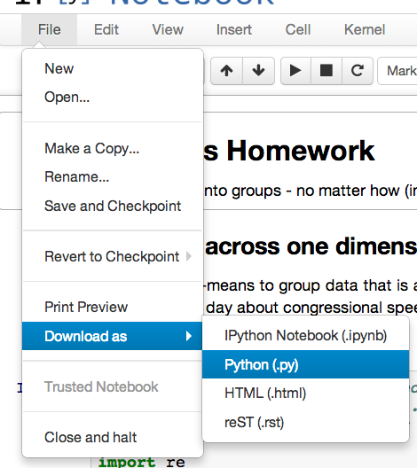

# Making your bot 

When you're just running in an IPython Notebook, your Twitter bot can only post when you hit *Play*. That's no fun, right?

Luckily, we can figure out a way around that. Your server has something called [cron](http://en.wikipedia.org/wiki/Cron) on it that lets you run Python scripts at specific intervals (every 10 minutes, every day at 12:03, once a week, etc). Let's figure out how it works!

## 1. Export to a Python script

IPython Notebooks (.ipynb files) can't be run from the command line, only a Python script can be (.py file). The first thing you'll need to do is export your notebook into a Python file. We haven't used raw Python files very much, but if you remember when we made our baby Quakebot that was a simple .py file. 

**To export:** Open up your notebook and Do *File > Download As > Python (.py)*.

You'll get a .py file sitting in your Downloads directory. Open it up, if you'd like - all of the markdown etc has been converted into comments!

## 2. Upload to your server

That file isn't going to do you very much good sitting on your own computer, you need to move it on up to your server. **scp** it to **~/**, using syntax along the lines of 

    scp -i /path/to/key weatherbot.py admin@0.0.0.0:~/

with `weatherbot.py` being your file, `0.0.0.0` being your server's IP, and `/path/to/key` being your `pem` file. It'll copy it into your home directory on the server. I'm going to pretend your filename is `weatherbot.py` for the rest of the instructions, so don't get mixed up!

**If your filename has spaces in it, get rid of them! They tend to cause a lot of problems, try underscores or hyphens instead.**

## 3. Test it out

`ssh` into your server, and try to run the script with

    python weatherbot.py

It probably won't print anything, but if you check your Twitter account it should have posted a new tweet! If you get an error about a duplicate tweet, check your IPython notebook and make sure you don't have any

    api.update_status("Testing")

kinds of lines that would always print the same content. If you do, erase the cell, re-download the .py, re-upload it to your server, and try to run it again.

## 4. Cron it up

Now it's time to use `cron` to make the script run every 10 minutes (or half hour, or whatever). Every task you give cron to run every once in a while is called a **cron job**, and you currently have one cron job - Charles set up your server to restart your ipython notebooks when the server is restarted.

Run `crontab -e` from the command line on the server to edit your cron lists. It should open up a big ol' file in nano full of comments - you'll want to move down to the bottom and make a new line that says...

    */30 * * * * python ~/weatherbot.py

With your filename, of course. `Ctrl+X` and Enter to exit, and you'll be on your way.

That particular line will run the weather bot every thirty minutes - */5 would be every five minutes, */10 every ten, etc. `30 * * * *` would make it run on the :30 of every hour (8:30, 9:30, 10:30), and `5 * * * *` would make it run on the :05 of every hour (11:05, 12:05, 1:05).

Want to run something once a day at noon, or every Monday at 3:03pm? Check out [Wikipedia's documentation on cron](http://en.wikipedia.org/wiki/Cron), I find it way more readable than most anything else.