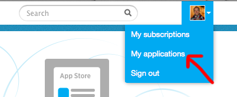
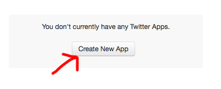
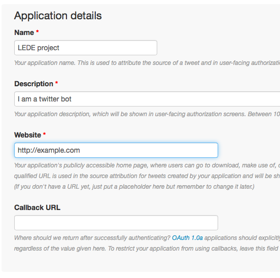
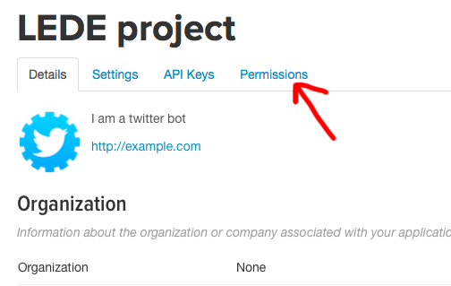
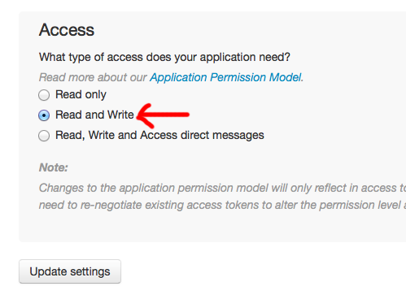
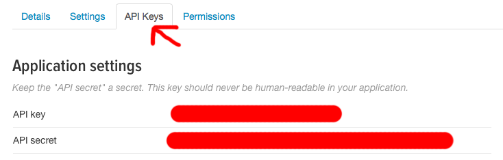
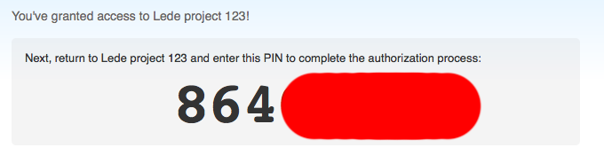

# Getting Twitter API Access

We're going to make a Twitter bot! Unfortunately we have to jump through way too many hoops to get to that point.

## 1. Make a master Twitter account

If you don't have one already, visit [twitter.com](http://twitter.com) and make an account for yourself.

### 1a. Confirm your email address

You'll need to check your email and confirm, just so they know who you are.

### 1b. Add your phone number to your Twitter account

And since email addresses just aren't enough, you'll also need to [add your phone number](https://twitter.com/settings/devices) to your account. Otherwise your bot will only be able to read from Twitter, not write to Twitter!

Be sure to turn off the text notifications after you confirm your phone.

## 2. Create an Application

Now hop on over to [http://dev.twitter.com](http://dev.twitter.com) and create a new Twitter application.

### 2a. Creating the Application

Don't stress too much about your application details, you're going to be the only one seeing them. They're mostly important if you're getting *other* people to sign up for your application.

### 2b. Permissions 

Now you'll want to make sure you can *write* two twitter. Select the **Permissions** tab on your project page...

...and set it to **Read and Write**. Then save.

### 2c. API Keys

Now you're going to need to grab your API keys.

Copy them into a new IPython Notebook, calling them `consumer_token` and `consumer_secret`.

    consumer_token = 'blahblahblah'
    consumer_secret = 'blahblahblah'

We aren't calling them `api_key` and `api_secret` because all code ever made ever in history ever ever calls them `consumer_token` and `consumer_secret`.

## 3. Create a Twitter account for your bot

Your Twitter bot needs to use a different account than your real, live primary account. I recommend giving it a **plus addressing** email address, where you do **+blahblahblah** after your email username - you'll still get the emails, but it acts like it's a separate account.

## 4. Authorize your bot

Now we need to authorize our robot account for the application.

### 4a. Installing tweepy

From your IPython notebook that includes `consumer_key` and `consumer_secret`, let's install [tweepy](http://www.tweepy.org), a module for interacting with Twitter.

    !pip install tweepy

### 4b. OAuth

Now we need to authenticate with Twitter. Tweepy's outline for this is

1. Get a request token from twitter
2. Redirect user to twitter.com to authorize our application
3. Get the verifier code from the user.
4. Exchange the authorized request token for an access token.

Sounds like fun, right? Let's do it.

    import tweepy
    auth = tweepy.OAuthHandler(consumer_token, consumer_secret)

Now get the authorization URL we'll need to visit

	auth.get_authorization_url()

Mine was something like `https://api.twitter.com/oauth/authorize?oauth_token=eUOvtXeDBfntN0OQI123znvgLG9fSFFRRWQNyV703KPs`. Visit this URL in your browser, *while signed in as the bot account*.

It will ask you to confirm that you'd like to grant access to the application, you say yes, then you're giving a **special code**.

Now hop back to your IPython notebook and feed it to tweepy.

	pin = '8640XXXX'

Run the authorization code

	token = auth.get_access_token(verifier=pin)

and now get your keys

	print token.key 
	print token.secret

and save them somewhere

	access_key = token.key
	access_secret = token.secret
	
**Additionally, copy and paste these values into a comment**, you don't want to try to authenticate again. 

### 4c. Test it out

api = tweepy.API(auth)
api.update_status('done and done')

## 5. Your glorious, robotic future

Whenever you're using your bot, you're going to need the access key + secret, as well as your consumer key + secret. If you start a new notebook to do that, you'll use

	auth = tweepy.OAuthHandler(consumer_key, consumer_secret)
	auth.secure = True
	auth.set_access_token(access_token, access_token_secret)
	api = tweepy.API(auth)

to create your tweetable API object, and then

	api.update_status('done and done')

to tweet. Want to know what all tweepy can do? [Check out the docs](http://tweepy.readthedocs.org/en/v2.3.0/api.html#tweepy-api-twitter-api-wrapper)!