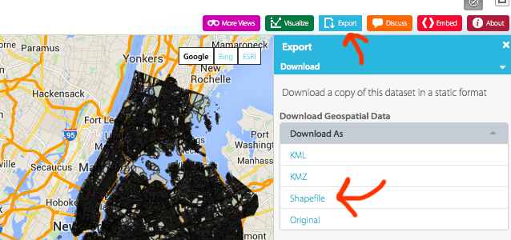
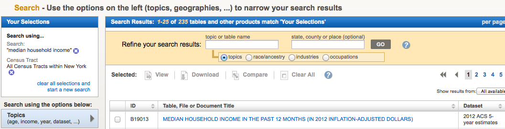
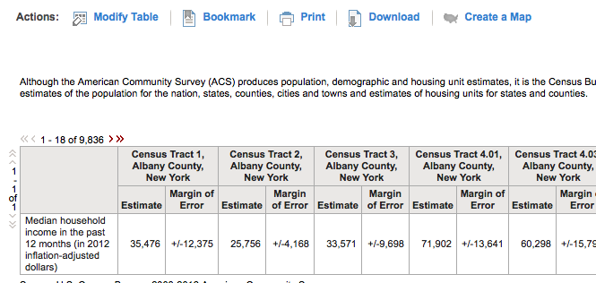
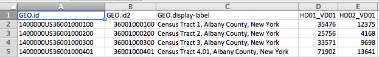
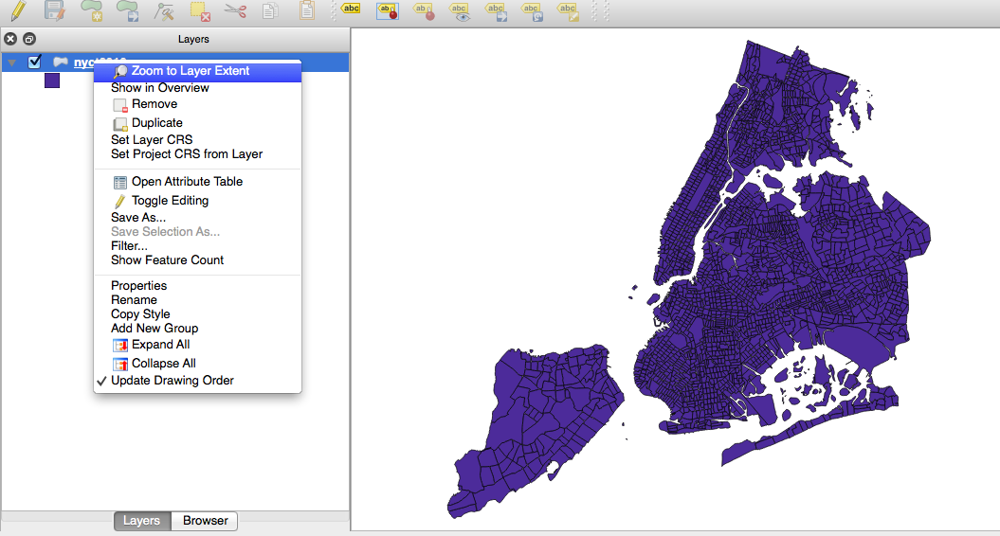
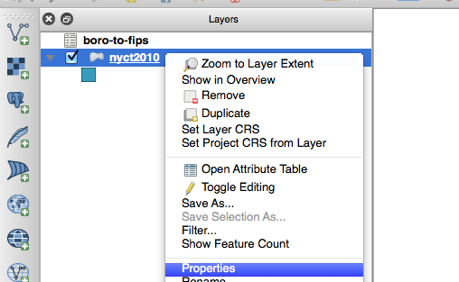
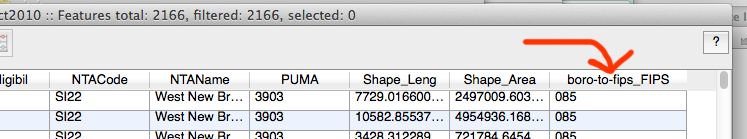
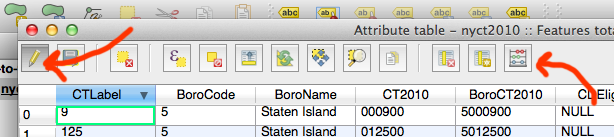
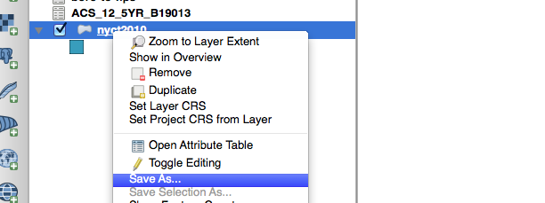

# TileMill + QGIS:  Merging Shapefiles and CSVs

**aka becoming the most powerful powerhouse in all of mapworld**

## The Data

Last time we did this we used state-level data. It was *all right*, but since we're going big with TileMill and QGIS we might as well go broke with census-tract-level data (...well, just for NYC).

### Part I: The Shapefile

If you search the NYC OpenData site for [census tracts](https://nycopendata.socrata.com/data?browseSearch=census+tracts) you come up with a nice shapefile of [NYC census tracts](https://data.cityofnewyork.us/City-Government/2010-Census-Tracts/h74c-n4ni) (make sure you get the one without the water areas). You'll want to download it by selecting `Export > Shapefile`

.

That picture isn't actually the census tracts, it's the census blocks - for some reason the tracts won't display right on the map. Download it anyway!

### Part II: The Census Data

The Census API was being real ornery, so I headed on over to the [American FactFinder](http://factfinder2.census.gov/faces/nav/jsf/pages/searchresults.xhtml?refresh=t) and did a little refining to get the data for the census tracts in all of New York State (we'll only use some of them!).



Don't get tricked when you're looking at the data - it looks like it goofed up and only gave you one row, but it has columns for *every single census tract in New York State*.



Download that. When it asks you about download options, select **Data and annotations in separate files** and uncheck **Include descriptive data element names**. By doing that you keep the data a *lot* cleaner.


If you're lazy, I have the download zipped up [right here](2012-acs-median-income-nyc.zip). The important data is hiding in `ACS_12_5YR_B19013.csv`.

## Examining the Data

Now we need to figure out how we're going to merge these bad boys.

### Inspecting the CSV

When you open up the CSV you'll see it only has a few fields...



If you'd like to see what they mean, open up `ACS_12_5YR_B19013_metadata.csv` for an explanation

| | |
|---|---|
|GEO.id|Id|
|GEO.id2|Id2|
|GEO.display-label|Geography|
|HD01_VD01|Estimate; Median household income in the past 12 months (in 2012 inflation-adjusted dollars)|
|HD02_VD01|Margin of Error; Median household income in the past 12 months (in 2012 inflation-adjusted dollars)|

Okay, not too informative, but you can tell `GEO.id` and `GEO.id2` both include some sort of FIPS codes since they all have `36` again and again. Seems like New York State to me!

### Inspecting the shapefile

Now open up `nyct2010.shp` in QGIS. If you'd like to see your shapefile, right-click its name and select `Zoom to Layer Extent`.



Now to see what sorts of fields are in the shapefile, right-click and select `Open Attribute Table`.


Unfortunately for us, there's **no matching field with the spreadsheet**. When we had states, we could just map state name to state name, but this is going to take a *bit* more legwork to manufacture a column to join on.

#### True GIS Detectives

Going back to the spreadsheet, it really looks like we're going to want to use the `GEO.id2` - it seems to be a shorter version of the `GEO.id1` field, and looks to have something to do with FIPS codes. Let's analyze it a little bit.

`36081010701` is the code for `Census Tract 107.01, Queens County, New York`. Here's what we know:

* The FIPS code of New York State is 36
* The FIPS code of Queens County is 81
* That census tract is 107.01

Using the power of our **huge brains**, we can kind of see the FIPS codes and the tract number hiding in that big long string. If we did a little [googling](http://www.policymap.com/blog/2012/08/tips-on-fips-a-quick-guide-to-geographic-place-codes-part-iii/), it might confirm our theory. This means we can break it down into the following

|State FIPS|County FIPS|Tract code|Full code|
|---|---|---|---|
|36|081|010701|36081010701|

Unfortunately for us (again), the shapefile is using something called `BoroCT2010` as its most specific code. If you google `BoroCT2010` you come acrosss [this document](http://www.nyc.gov/html/dcp/pdf/bytes/nyct2010_metadata.pdf) which claims it is "Merged string of borough code and census tract number". The second half is looking good, but what's a borough code? This nonsense, which has *nothing* to do with FIPS codes

|Borough|Borough Code|
|---|---|
|1|Manhattan|
|2|Bronx|
|3|Brooklyn|
|4|Queens|
|5|Staten Island|

`BoroCode` also has its own field, as is `CT2010` (the census tract code). We can identify the borough and identify the tract, but somehow we need to transform that `BoroCode` into a FIPS code to add on to the tract number.

#### What hell hath NYC wrought?

In order to solve this, we need to execute *two* merges, not just one. We'll need to do something like this:

1. Create a CSV that maps `BoroCode` values to FIPS codes
2. Merge that into the shapefile, so each row now has the correct county FIPS code
3. Create a new column in the shapefile that adds 36 + FIPS code + tract number
4. *Finally* merge the census data in, joining the csv's `GEO.id2` with our new 36+FIPS+tract column

Are you ready? **ARE YOU READY?!** Let's do this.

## Create the BoroCode-to-FIPS-code CSV

This part is easy. Just make a CSV that maps each `BoroCode` to a FIPS code. You can make it in Excel and export it to CSV, or just type it into a CSV. If you make it in Excel, **be sure to make the column a Text columns**, otherwise you'll lose leading `0`'s.

|BoroCode|FIPS code|
|---|---|
|1|061|
|2|005|
|3|047|
|4|081|
|5|085|

You can download my version [right here](boro-to-fips.csv). Make sure you get the raw version.

## Merging the county FIPS codes into the shapefile

This part isn't that bad, either. First, you'll need to have your shapefile open in QGIS and added to the project.

Next you'll want to add a new file to the project. Add a new **Vector Layer** by clicking the line-with-dots icon to the left of your screen, or using `Layer > Add Vector Layer`


Why do you not add it as a CSV, using that comma-looking button? As far as I can tell, you only use the comma-button when you're dealing with a CSV that has latitude and longitude columns. **For a data csv, always use Add Vector Layer.**

Now open up the properties of the `nyct2010` shapefile by right-clicking and selecting `Properties`



Select `Joins` and select the two fields that are going to match between the two - `BoroCode` for the CSV, and `BoroCode` for the shapefile. The `join layer` will be the CSV layer.


Click `OK`. **What did it do?** Open up the Attribute table by right-clicking `nyct2010` and selecting `Open Attribute Table`. If you scroll all the way to the right you'll see a new field with the FIPS code in it!



## Creating a new (calculated) column in the shapefile

Now that we've added the correct FIPS code into each row instead of that pesky `BoroCode`, we need to add together the state FIPS and the county FIPS and the tract number to be able to match the `GEO.id2` column.

Now, adding a column to the shapefile isn't as easy as the `=CONCATENATE(...` thing we did with Excel, but it isn't *too bad*.

While still viewing the Attribute Table, click the little pencil in the top left hand corner. This turns on **edit mode**. Then click the abacus in the far right corner to open up the **field calculator**.



In the menu that opens up, ame the new field up top (I'm calling mine `FullFIPS`), set it to Text and give it a length of at least `11`. We want to make a new column, so keep `Create a new field` checked. Then you'll need to fill in the `Expression` down at the bottom.


You can play around with the `Functions` pane on the left to get an idea of what kinds of operations you can perform when creating a new column. QGIS is kind of ...special in how it deals with columns. **Important [read: weird] things to note:**

* Instead of using `CONCAT` or `+` to add strings together, QGIS uses `||`, a double pipe.
* If you use a field name as a variable, you need to put it in quotes. Text that isn't in quotes is treated as a string. Yes, it's the exact opposite of Python.
 
So for example, `36 || "boro-to-fips_FIPS"` adds together the string `36` with the contents of the `boro-to-fips_FIPS` column. If we're looking to concatenate `36` with the joined FIPS code and the census tract? `36 || "boro-to-fips_FIPS"  || "CT2010"` is our winner.

As you're filling in your expression, be sure to look at the result of `Output preview`. Does it look like the codes we're searching for? I took the sample output and searched for it in the CSV. Worked like a charm!


Click `OK` and you should be good to go with your brand-new join field! After the window closes, right click `nyct2010` and click `Toggle Editing` to remove the checkmark and save your progress.

## Joining the income data

Remember how we [joined the BoroCode-FIPS csv earlier](#merging-the-county-fips-codes-into-the-shapefile)? It's the exact same deal.

1. Add `ACS_12_5YR_B19013.csv` as a new Vector Layer (not the annotations or metadata files!)
2. Open up the `Properties` of `nyct2010` and select `Joins`
3. Add a new join, choosing `ACS_12_5YR_B19013` as the join layer and `GEO.id2` as the join field. Your target field is `FullFIPS`, your brand-new FIPS code field.
4. Click `OK` to all of that and get back to the main screen. Open up the attribute table, scroll to the left, and see if your join worked. You should have a few new fields!


## Make sure everything is the right data type

Remember how we had to compare the hurricane zones as strings a while back? Let's make sure it knows the numerical fields are actually numbers. Head on over to the `Properties` of `nyct2010`. Select `Fields` and scroll down.

Look at `ACS_12_5YR_B19013_HD01_VD01` - it's a **STRING!** There are a hundred equally terrible ways of fixing this (if you do this a lot, you'll want to look at [csvt files](http://anitagraser.com/2011/03/07/how-to-specify-data-types-of-csv-columns-for-use-in-qgis/)), but since it's only one column let's just use the **field calculator** again to make a new, converted field.

Click the **pencil**, then the **abacus**, and you're back in the field calculator.

This time we're again creating a new field (let's call it `income`). An `integer` is fine, as is 10 for the output field length.

If you want, you can use the `Function List` to compile your function - `Conversions > toint` and then `Fields and Values > ACS_12_5YR_B19013_HD01_VD01`. You'll just need to close the parens and you'll get a pleasant `toint(  "ACS_12_5YR_B19013_HD01_VD01" )`. 

Seems good, right?

Nope. Error message - `Cannot convert '' to int`. It feels like we're back in Python again! Trying to convert `''` to an integer is clearly not going to work, so we need to make sure we only try to convert columns that *aren't* blank strings.

Browsing around, `Conditions > Case` sets us up with what looks like an **if** statement. You can use the right hand pane to get an explanation of how it works. To ignore every `ACS_12_5YR_B19013_HD01_VD01` that's an empty string, and convert everything that's not, try this:

```
CASE 
  WHEN "ACS_12_5YR_B19013_HD01_VD01" IS '' THEN NULL 
  ELSE toint(  "ACS_12_5YR_B19013_HD01_VD01" ) 
END
```

Once you've successfully added that column, turn off edit mode, scroll through the attribute table to make sure things look all right. If it's A-OK, now it's time to **EXPORT!**

## Exporting the new shapefile

`File > Save` in QGIS saves a **QGIS project**, not your cool new shapefile. **QGIS projects can't be imported into TileMill, though, only the resulting shapefile.**

You'll want to save the QGIS project if you're worried about having made a mistake, or if you want to re-join or anything later (just so you don't have to repeat all the steps again). But if you'd like to make use of your shapefile, you'll need to export it individually.

To save (or export) the shapefile, you'll need to right-click and select `Save As...`. You can also do this from the `Layer` menu up top.



You've got a lot of options now!

* Make sure `Format` is on `ESRI Shapefile`.
* Click `Browse` to find a location (and name) for your new shapefile
* Keep CRS and Encoding the defaults for now.

Click `OK` and you've got yourself a brand new shapefile!

> If you end up having trouble importing the shapefile into a project later, and it's appearing in weird places and stuff, select `Selected CRS`, click `Browse`, and type `4326` into the `Filter` box. Select `WGS 84 / ESRI: 4326` and continue your export.

## Importing into TileMill

Same as ever! Do what you've done every other time - make a project, add a layer, etc etc.

If you look at the attributes table (aka features), you'll notice it shortened some of the longer column names - you now have things like `ACS_12_5_2` instead of `ACS_12_5YR_B19013_HD01_VD01`. It doesn't make you lose data, but it's something to keep in mind.

Now we're ready for the good stuff: with a little bit of a reference layer and a few minutes of laying down some color rules, you've got a pretty badass map!


You can download the complete shapefile [right here](merged-income-tracts.shp). (Not the colored picture above, but the one with all the joins)