# Mapping Merged Data in TileMill + QGIS

**AKA mapping state median income like a pro**

# The Data

When you're mapping data, you'll have two pieces of info: the part that goes on the map, and the data associated with the part that goes on the map. Sometimes they come together (e.g. the hurricane shapefile contained evac zone data) or sometimes they come apart (state shapefile + csv of median incomes). In the latter case, you have to merge them.

### The data half: the state-based income csv

Just like we did with Google Fusion Tables, it's the same data you used with the census (just in CSV form). Looks something like this:

|state|NAME|B19013_001E|
|---|---|---|
|01|Alabama|42934|
|02|Alaska|69014|
|04|Arizona|50752|
|05|Arkansas|40149|

You can find it at [census-state-median-income.csv](census-state-median-income.csv), and the code I used to pull it is at the bottom of the page

### The appable half: The shapefile

Now we're going to need the geographic part of the equation - the state outlines. When we were using Google Fusion Tables we found a KML file Google uploaded (slash a Fusion table of states), which would work just fine, but let's get some more experience using shapefiles instead.

Googling "state shapefile" gives you plenty of options, but the [Census bureau result](https://www.census.gov/geo/maps-data/data/cbf/cbf_state.html) seems like a good choice. It gives you options with different levels of resolutions - 1:500k, 1:5mil or 1:20mil. Since filesize doesn't matter to us, let's get the best resolution: [500k](http://www2.census.gov/geo/tiger/GENZ2010/gz_2010_us_040_00_500k.zip).

## Inspecting your data

Now we need to figure out how we're going to merge these together.

First, open up your median income CSV. What fields do you have?

|state|NAME|B19013_001E|
|---|---|---|
|01|Alabama|42934|
|02|Alaska|69014|
|04|Arizona|50752|

Looks like a **FIPS code**, a **state name** and an **income field**.

Now let's open up the shapefile and see if we'll be able to join on any of those fields. If your browser didn't automatically unzip the file, do so now. Inside you'll see plenty of files, including a `.shp` file. Double-click and it should automatically open up in QGIS.

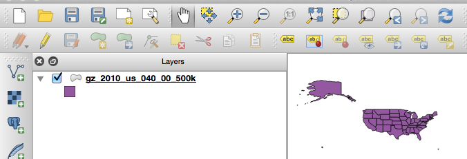

Beautiful! You'll see the shapefile fall into a list on the left-hand side of the screen. In QGIS each shapefile makes up a **layer** in a project, and you'll end up being able to set them one on top of the other or do operations between them (sharing columns, counting points-in-a-polygon, etc). For now, though, we're just working with one.

In order to see what fields the shapefile has inside of it, you'll need to right-click the layer's name - `gz_2010_us_040_00_50k` - and select `Open Attribute Table`.


It'll give you a big long list of fields, just like a spreadsheet! It's tough to edit, though, so hopefully if you're making any changes it's on the CSV side.


Looks like we've got a **FIPS code** and a **state name** - we could join on either! How convenient.

# Merging the Data

Merging data in QGIS is similar to merging data in Google Fusion Tables, but a tiny bit more work. I'd say it's well worth it in the end, though, since you get to pop your data into TileMill.

## Importing the CSV

First, you'll need to add the CSV to your QGIS project. You can do this by either clicking the menu item that looks like a line with dots on it, or going to `Layer > Add Vector Layer`

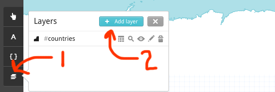

You might think because it's a CSV you'd use the comma-looking button down on the bottom left. **YOU DON'T.** Not unless (generally speaking) you're importing a CSV with latitude and longitude. **Data CSVs always get added as Vector Layers.**

Once `census-state-median-income` appears over by `gz_2010_us_040_00_50k` you're ready to merge.

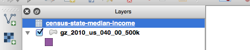

## Merging

**OKAY.** *Let's do this.*

First, right-click the shapefile layer (`gz_2010_us_040_00_50k`) and select `Properties`


Next select the `Join` tab on the left and click the plus symbol to add a new join.

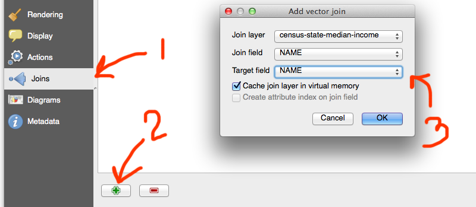

**Join layer** is the layer you're going to be joining to. That'll be the csv - `census-state-median-income`.

**Join field** is the field in the CSV you're going to be joining to. In this case, the state's name is held in the `NAME` column (you'll often have to open up the CSV to check).

**Target field** is the field in the shapefile you're joining with. The state's name is in the attribute `NAME`, so you'll select that. I generally forget the field name and have to exit out, look at the attribute table, and then go back in and make the join.

Then click `OK`.

## Checking the merge

Now you've gotta make sure it went through okay! You'll do that by checking out the **attributes table**. Open it up again by right-clicking the shapefile layer, and selecting `Open Attribute Table`.


Sometimes you'll have to scroll far to the right, but in this case it's pretty clear: the join was successful, and you have your median income in a column. But now let's make sure it's the right **data type** - you want to make sure it's a number, not a string!

Exit out of the attributes table and right-click the layer name, selecting `Properties`. Click `Fields` on the left hand side and groan loudly: **income is a String!**

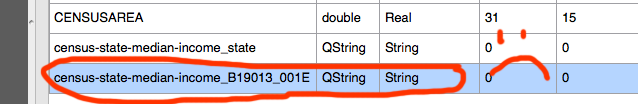

This would cause big problems later on when we'll want to add styles relative to the income values: you can't do `>` or `<` comparisons on a string, of course!

## Changing the column type

Now we'll need to create a whole new field that converts the income field string to an integer. We'll use the **Field Calculator** for this.

From the `Fields` tab, click the pencil icon to make the shapefile editable, then click the abacus icon to open up the Field Calculator.


The Field Calculator is pretty friendly for being a garish beast - you generally don't have to type anything, you can just select from the menus.

First, fill out the new field's name (`income`) and confirm that it's a `Whole number (integer)`. `10` should be good enough for the field width.

Now, go through the function list. We need to **convert** something, right? Open up `Conversions` and you'll see `toint`. Click it.

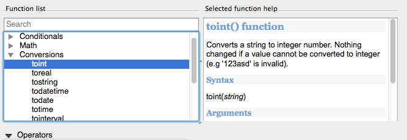

The right hand pane will open with some info on the function, explaining how to use it and what it does. If that looks good to you, double-click `toint` to cause it to appear in the `Expression` field.

Now what are we converting? That field! Open up the `Fields and Values` section (it's near the bottom of the functions list) and sure enough, `census-state-median-income_B19013_001E` is hiding down there. Double-click it, too.

Now your `Expression` field should look something like

```
toint(  "census-state-median-income_B19013_001E" 
```

With a big ugly **Expression is invalid** message below it. We're good enough programmers to know what's missing - a closing parenthesis!

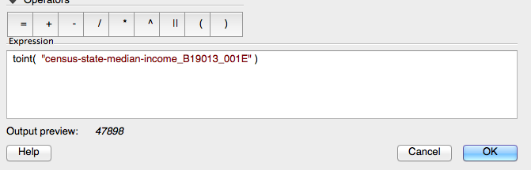

Click `OK` to save the new field, then click the pencil again to revert away from edit mode. Agree to save.

Feel free to open up the attributes table again just to double-check what you did. Sure enough, there's your new `income` field!

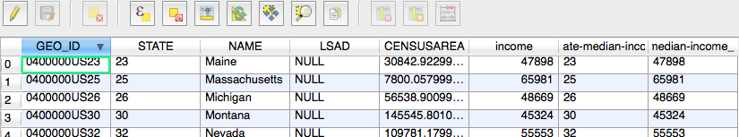

## Exporting from QGIS

The *thing* you're in with all of these files is a big ol' QGIS project. Can't import that into TileMill! You need to just export the **shapefile.**

Right-click the shapefile and select `Save As...`. Don't change anything on the save screen except the filename - hit browse and find a good location for it!

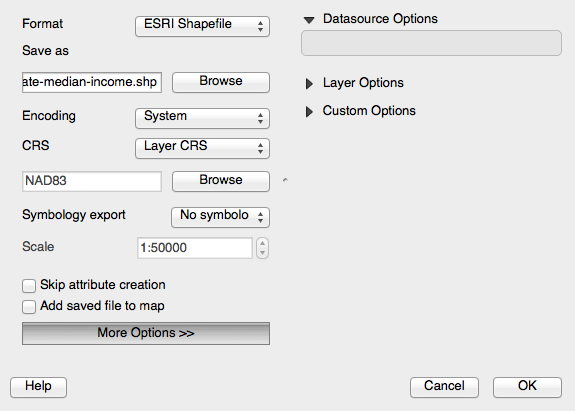

Once you've successfully exported it, you're ready to take it into TileMill. If you'd like to save the QGIS project to come back to later, you can do that, too, but otherwise feel free to discard it.

# Importing into TileMill

Create a new project in TileMill (`Project` tab, `+ New Project`), giving it a filename of something like `states-median-income`, and a name like `Median income across states`

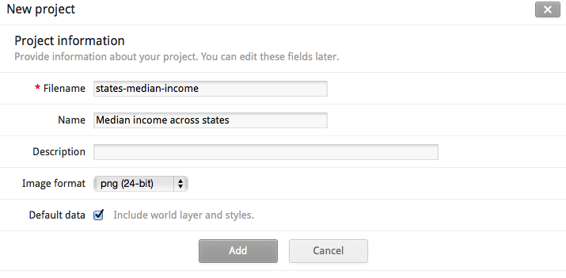

Click `Save & Style` to save it, then open it from the Projects screen.

Add your new layer by opening up the **Layers** popover from the icon in the bottom-right-hand corner.


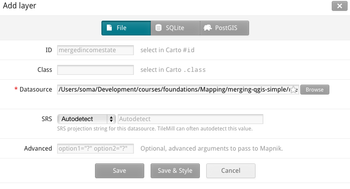

Save & Style and you'll be good to go!


Except, of course, that it's ugly. From the layers popup, select the **Features** option, which kind of looks like a spreadsheet. Once you click it you'll get a view of all of the attributes on the table, including `income`.


Once you get an idea about how you'd like to split up your data, close the Features window and hop on over to the **style pane** on the right. A few style changes, and tada! You've got a brand-new map.

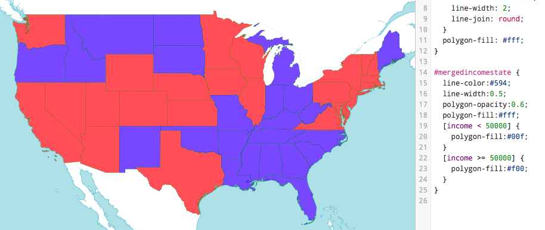

And now you're all set! Big ups.

I've included the joined shapefile [right here](merged-income-state.zip) (not the colored version from TileMill, just the shapefile that I imported).

---

### Census Data Code

How I pulled the census data

```python
from census import Census
from us import states
import unicodecsv

c = Census("YOUR_KEY_HERE")
state_data = c.acs.state(('NAME', 'B19013_001E'), '*')

census_file = open('census-state-median-income.csv', 'wb')
fieldnames = state_data[0].keys()
writer = unicodecsv.DictWriter(census_file, fieldnames=fieldnames)
headers = dict((n,n) for n in fieldnames)
writer.writerow(headers)
for state in state_data:
    writer.writerow(state)
census_file.close()
```

**Notes:** I used the same API we covered in the Census classes. `unicodecsv` is a drop-in replacement for `csv` that works with unicode values, and DictWriter is a way of writing dictionaries to a csv.